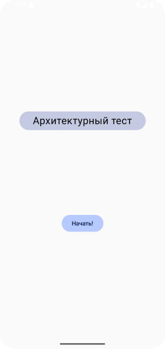
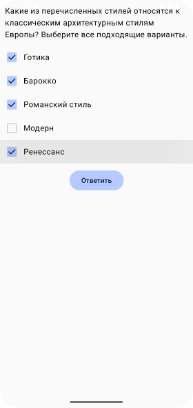
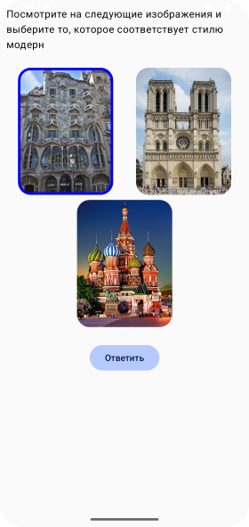
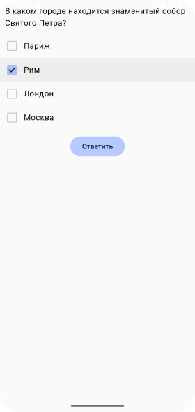
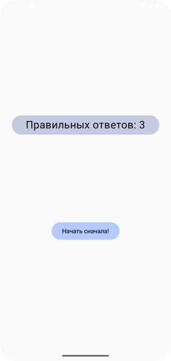

# Домашнеее задание по теме "Selectable"

## Исторический тест

На основе пройденного материала необходимо написать приложение «Исторический тест».

Приложение должно состоять из ~~4~~ 5 экранов:

главное меню,
первый вопрос,
второй вопрос,
третий вопрос,
результаты.

На экране главного меню должно располагаться название приложения, и кнопка «Начать», которая переносит пользователя на экран с первым вопросом.

Экран первого вопроса должен включать в себя:

1. `Text` с самим вопросом на историческую тему;

2. `Checkbox`’ы с вариантами ответов;

3. `Button` «Ответить», которая переносит пользователя к следующему экрану с вопросом. Правильных ответов должно быть несколько.

Экран второго вопроса должен включать в себя:

1. `Text` с самим вопросом на историческую тему;

2. `Checkbox`’ы с вариантами ответов;

3. `Button` «Ответить», которая переносит пользователя к следующему экрану с вопросом. Правильных ответов должно быть несколько. Все идентично экрану первого вопроса, кроме содержания.

Экран третьего вопроса должно включать в себя:

1. `Text` с самим вопросом на историческую тему;

2. `Selectable` компоненты, которые представляют собой варианты ответа;

3. `Button` «Ответить», которая переносит пользователя на экран с результатами теста.

В данном случае правильный ответ должен быть только один. В качестве вариантов ответа должны быть представлены изображения.

Экран с результатами должен включать в себя:

1. Text с результатами в формате: «Ваш результат: (значение) из 3»;
2. `Button`, который возвращает пользователя в главное меню.

Конечный результат должен выглядеть примерно так:

Приложение необходимо сохранить проектом в удаленном репозитории, для проверки качества предоставить ссылку преподавателю, либо сделать скрины эмулятора при каждом шаге работы приложения или снять видео экрана при работе приложения

## Скриншоты домашнего задания

Скриншоты скрыты здесь

